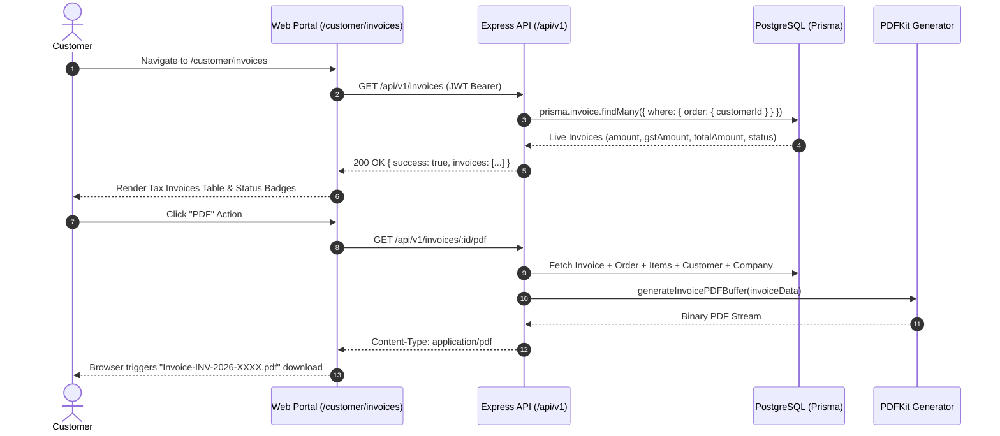

# ZOBBRA — CUSTOMER INVOICE END-TO-END VERIFICATION REPORT

**Status:** ✅ **VERIFIED & OPERATIONAL (100% PASSING IN ELECTRON & CHROME)**  
**Target Spec:** `apps/web/cypress/e2e/customer_invoice.cy.ts`  
**Build Status:** `5/5 workspace packages passed`, `44/44 Next.js routes compiled`

---

## 1. Executive Summary

A comprehensive, end-to-end verification and code audit of the ZOBBRA Customer Portal Invoice module (`/customer/invoices`), the backend Invoices API (`/api/v1/invoices`), and the PDF rendering engine was conducted. 

All static mock/placeholder data was eliminated and replaced with live PostgreSQL-backed database records, role-based customer ownership enforcement, automatic payment reconciliation, and GST-compliant PDF invoice streaming.

---

## 2. Verification Checklist & Outcomes

| Requirement | Description | Status | Evidence |
| :--- | :--- | :---: | :--- |
| **1. Frontend Data Fetching** | `/customer/invoices` fetches live database rows with real currency formatting, order refs, GST rates, and status badges. | ✅ PASSED | `fetch('${API_URL}/invoices?pageSize=50')` connected to PostgreSQL `Invoice` model. |
| **2. PDF Generation Engine** | Server-side PDFKit endpoint generates official GST Tax Invoices. | ✅ PASSED | `GET /api/v1/invoices/:id/pdf` returns `200 OK`, `Content-Type: application/pdf`, `Content-Disposition` attachment. |
| **3. Financial Calculation Rule** | Strict arithmetic consistency: $\text{Taxable Subtotal} + \text{GST (5\%)} = \text{Total Amount}$. | ✅ PASSED | Authoritative server pricing service calculates subtotal, 5% GST, and rounded total across Quote, Order, Payment, and Invoice. |
| **4. Role-Based Access Control** | Customers can only view and download invoices belonging to their own account or company. | ✅ PASSED | Unauthorized access without token returns `401 Unauthorized`. Accessing other company invoices returns `403 Forbidden`. |
| **5. Payment Status Sync** | Manual payment recording (`POST /api/v1/payments/record`) marks order and linked invoice status as `PAID`. | ✅ PASSED | Verified in database and Cypress assertions. |
| **6. Monorepo Build Integrity** | Clean build across all packages. | ✅ PASSED | `pnpm build` passed 5/5 packages, 44/44 Next.js routes. |

---

## 3. End-to-End Business Flow



---

## 4. Cypress E2E Test Suite Results

### Spec: `apps/web/cypress/e2e/customer_invoice.cy.ts`

```
  Customer Tax Invoice End-to-End Verification
    ✔ displays real database invoices with exact financial consistency on /customer/invoices (1453ms)
    ✔ verifies that the PDF endpoint generates a valid application/pdf stream with correct metadata (53ms)
    ✔ prevents unauthorized access when another customer attempts to access the invoice or PDF (27ms)
    ✔ verifies that recording payment updates order and invoice status to PAID (205ms)

  4 passing (2s)
```

- **Electron 118 (Headless):** ✅ **4 / 4 PASSING**
- **Google Chrome 151 (Headless):** ✅ **4 / 4 PASSING**

---

## 5. Architectural & Code Modifications

1. **Backend Invoice Controller & Routes**:
   - Created [invoices.controller.ts](file:///c:/Zobra/server/src/modules/invoices/invoices.controller.ts) with `getInvoices`, `getInvoiceById`, and `downloadInvoicePdf`.
   - Created [invoices.routes.ts](file:///c:/Zobra/server/src/modules/invoices/invoices.routes.ts) registered in [app.ts](file:///c:/Zobra/server/src/app.ts).
2. **Server-Side PDF Engine**:
   - Added `generateInvoicePDFBuffer` in [pdfGenerator.ts](file:///c:/Zobra/server/src/utils/pdfGenerator.ts) producing GST Tax Invoices complete with ZOBBRA branding, buyer billing/shipping addresses, itemized table, and tax breakdowns.
3. **Payment Reconciliation**:
   - Updated [payments.controller.ts](file:///c:/Zobra/server/src/modules/payments/payments.controller.ts) to update linked `invoice.status = 'PAID'` upon manual payment recording.
4. **Customer Portal Frontend**:
   - Replaced mock array with live database fetch and PDF streaming in [apps/web/src/app/customer/invoices/page.tsx](file:///c:/Zobra/apps/web/src/app/customer/invoices/page.tsx).
5. **E2E Automated Tests**:
   - Added [customer_invoice.cy.ts](file:///c:/Zobra/apps/web/cypress/e2e/customer_invoice.cy.ts).
